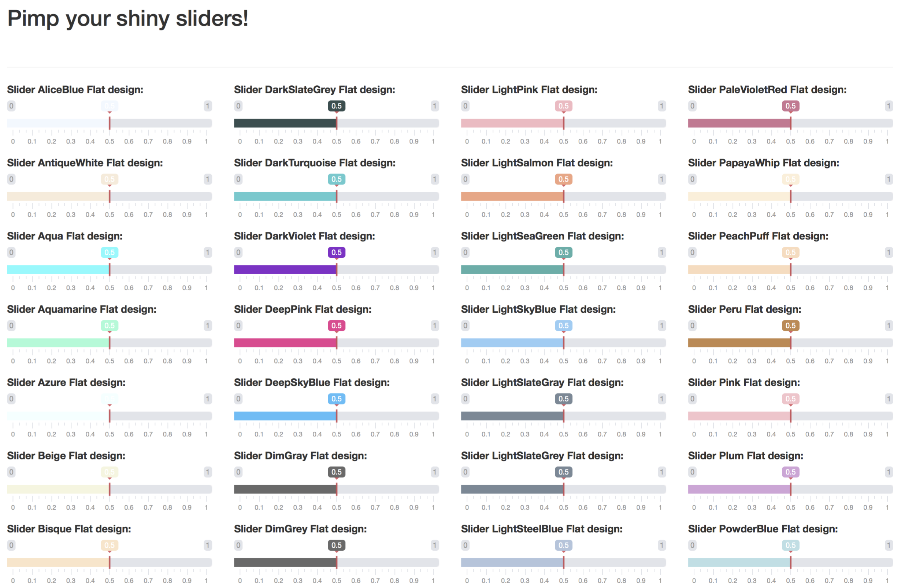
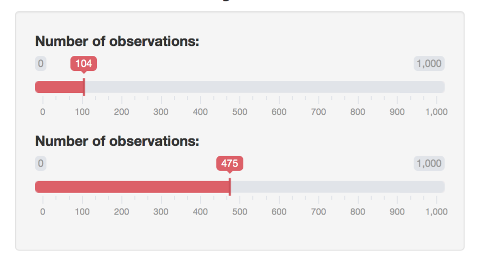
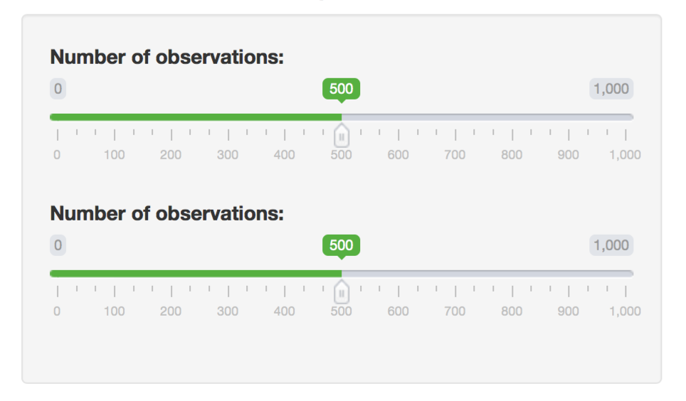
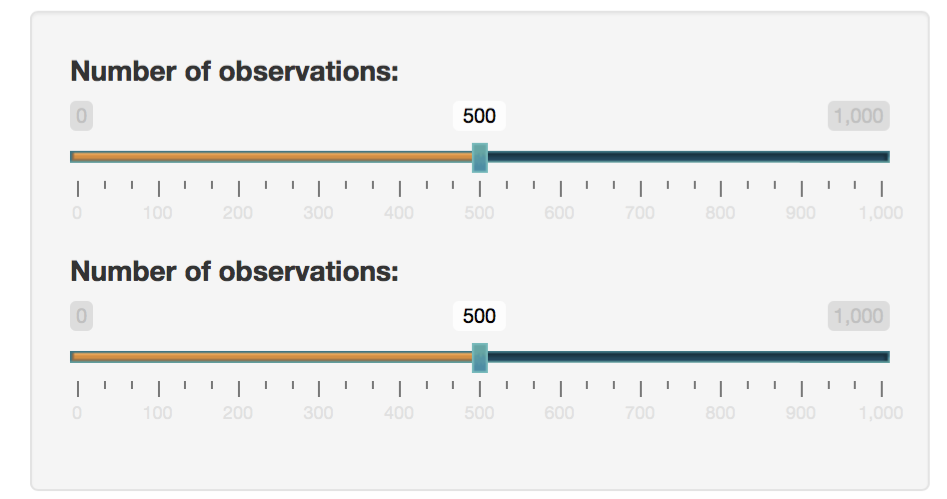
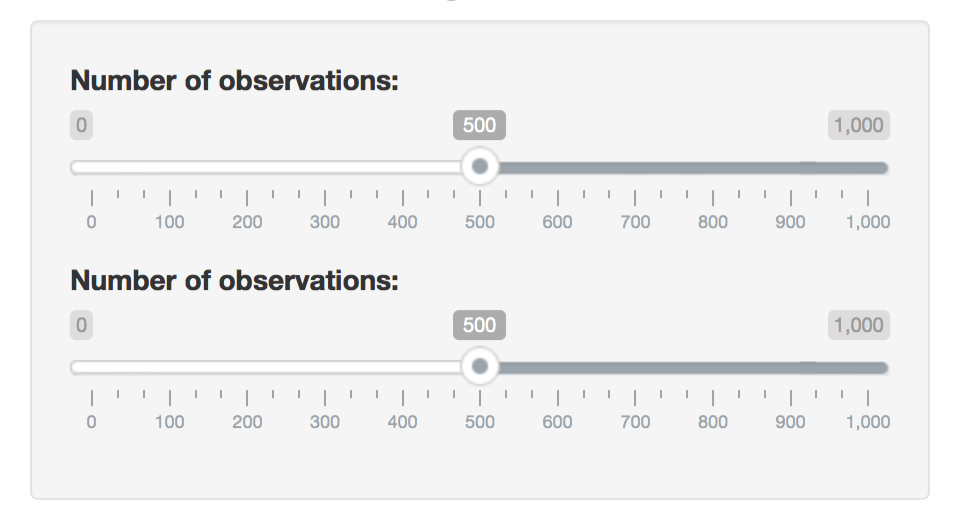
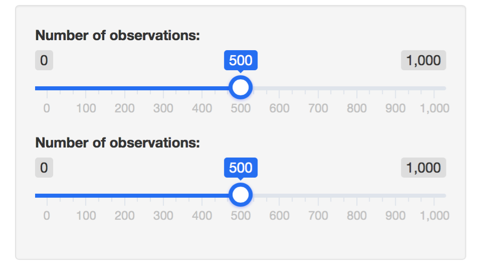
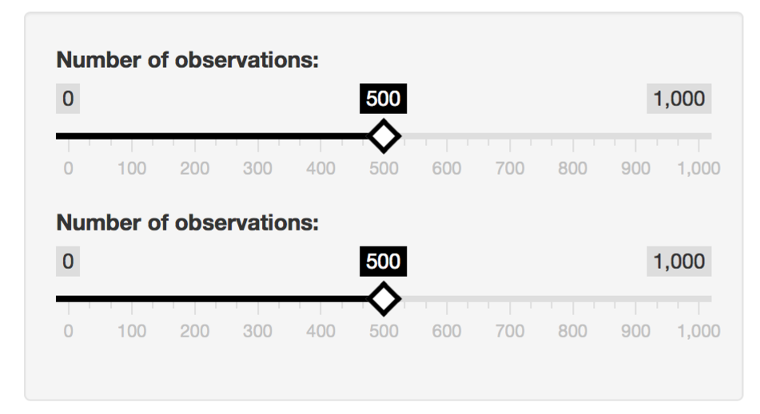

+++
  title = "How to customize shiny sliderInput"
  date = "2017-11-11"
+++
    
Sometimes, you might get bored by the design of the **sliders** in Shiny. This input widget
uses the [Ion.Rangeslider](http://ionden.com/a/plugins/ion.rangeSlider/en.html) js library.
In the advanced [section](http://ionden.com/a/plugins/ion.rangeSlider/demo_advanced.html),
you can notice that 5 themes are actually available. I really like the flat ui skin.
In this tutorial, I will describe a way to choose new themes for your shiny
sliders.

## Use shinyWidgets

Recently, I added 2 functions to the shinyWidgets package of [dreamRs](https://github.com/dreamRs/shinyWidgets):
- chooseSliderSkin to set the global skin of all your sliders.
Unfortunately, you cannot have different skin for each slider.


library(shiny)
library(shinyWidgets)

ui <- fluidPage(

  # use the Modern design
  chooseSliderSkin("Modern"),
  sliderInput("obs", "Customized slider1:",
              min = 0, max = 100, value = 50
  ),
  sliderInput("obs2", "Customized slider1:",
              min = 0, max = 100, value = 50
  ),
  sliderInput("obs3", "Customized slider1:",
              min = 0, max = 100, value = 50
  ),
  plotOutput("distPlot")
)

server <- function(input, output) {

  output$distPlot <- renderPlot({
    hist(rnorm(input$obs))
  })
}

shinyApp(ui, server)



- setSliderColor to pass a custom color for each slider. The color code 
can either be HEX code or the name of [CSS color](https://www.w3schools.com/colors/colors_names.asp) to have an overview of all colors.


library(shiny)
library(shinyWidgets)

ui <- fluidPage(

  # only customize the 2 first sliders and the last one
  # the color of the third one is empty
  setSliderColor(c("DeepPink ", "#FF4500", "", "Teal"), c(1, 2, 4)),
  sliderInput("obs", "My pink slider:",
              min = 0, max = 100, value = 50
  ),
  sliderInput("obs2", "My orange slider:",
              min = 0, max = 100, value = 50
  ),
  sliderInput("obs3", "My basic slider:",
              min = 0, max = 100, value = 50
  ),
  sliderInput("obs3", "My teal slider:",
              min = 0, max = 100, value = 50
  ),
  plotOutput("distPlot")
)

server <- function(input, output) {

  output$distPlot <- renderPlot({
    hist(rnorm(input$obs))
  })
}

shinyApp(ui, server)


Hope you will enjoy this customization!


library(shiny)
library(shinyWidgets)

slider_colors <- c("AliceBlue",
"AntiqueWhite", 	
"Aqua",
"Aquamarine",
"Azure",
"Beige",
"Bisque",
"Black",
"BlanchedAlmond", 	
"Blue",
"BlueViolet",	
"Brown",
"BurlyWood",
"CadetBlue",
"Chartreuse",	
"Chocolate",	
"Coral",
"CornflowerBlue",	
"Cornsilk",
"Crimson",
"Cyan",
"DarkBlue",
"DarkCyan",
"DarkGoldenRod",	
"DarkGray",
"DarkGrey",
"DarkGreen",	
"DarkKhaki",
"DarkMagenta", 	
"DarkOliveGreen",	
"DarkOrange",	
"DarkOrchid",	
"DarkRed",
"DarkSalmon",	
"DarkSeaGreen", 	
"DarkSlateBlue", 	
"DarkSlateGray", 
"DarkSlateGrey",
"DarkTurquoise", 	
"DarkViolet",	
"DeepPink",
"DeepSkyBlue", 	
"DimGray",
"DimGrey",
"DodgerBlue",	
"FireBrick",
"FloralWhite", 
"ForestGreen", 	
"Fuchsia",
"Gainsboro",
"GhostWhite",	
"Gold",
"GoldenRod",	
"Gray",
"Grey",
"Green",
"GreenYellow", 	
"HoneyDew",
"HotPink",
"IndianRed",	
"Indigo",
"Ivory",
"Khaki",
"Lavender",
"LavenderBlush", 	
"LawnGreen",	
"LemonChiffon", 	
"LightBlue",
"LightCoral",	
"LightCyan",
"LightGoldenRodYellow", 	
"LightGray",	
"LightGrey",
"LightGreen",	
"LightPink",
"LightSalmon", 	
"LightSeaGreen", 	
"LightSkyBlue", 	
"LightSlateGray", 	
"LightSlateGrey", 	
"LightSteelBlue", 	
"LightYellow", 	
"Lime",
"LimeGreen",	
"Linen",
"Magenta",
"Maroon",
"MediumAquaMarine", 
"MediumBlue",	
"MediumOrchid", 	
"MediumPurple",	
"MediumSeaGreen", 	
"MediumSlateBlue", 	
"MediumSpringGreen", 	
"MediumTurquoise", 	
"MediumVioletRed", 	
"MidnightBlue", 	
"MintCream",
"MistyRose",	
"Moccasin",
"NavajoWhite", 	
"Navy",
"OldLace",
"Olive",
"OliveDrab",	
"Orange",
"OrangeRed",	
"Orchid",
"PaleGoldenRod", 	
"PaleGreen",	
"PaleTurquoise", 
"PaleVioletRed", 	
"PapayaWhip",	
"PeachPuff",	
"Peru",
"Pink",
"Plum",
"PowderBlue",	
"Purple",
"RebeccaPurple", 	
"Red",
"RosyBrown",
"RoyalBlue",	
"SaddleBrown", 	
"Salmon",
"SandyBrown",	
"SeaGreen",
"SeaShell",
"Sienna",
"Silver",
"SkyBlue",
"SlateBlue",	
"SlateGray",	
"SlateGrey",	
"Snow",
"SpringGreen", 	
"SteelBlue",
"Tan",
"Teal",
"Thistle",
"Tomato",
"Turquoise",	
"Violet",
"Wheat",
"White",
"WhiteSmoke",
"Yellow",
"YellowGreen")

ui <- fluidPage(
  
  title = "setSliderColor/chooseSliderSkin demo",
  
  titlePanel("Pimp your shiny sliders!"),
  
  setSliderColor(slider_colors, 1:length(slider_colors)),
  
  chooseSliderSkin("Flat"),
  
  br(), hr(),
  
  # create a set of 148 sliders
  # to test the 148 css colors
  fluidRow(
    lapply(0:3, FUN = function(j) {
      column(
        width = 3,
        lapply((1:37) + 37 * j, FUN = function(i) {
          tagList(
            sliderInput(
              inputId = paste0("slider", i), 
              label = paste("Slider", slider_colors[i], "Flat design:"),
              min = 0, max = 1, value = 0.5
            )
          )
        })
      )
    })
  )
)

server <- function(input, output, session) {
  
}

shinyApp(ui, server)



The code above will give the image below

 

 

 

 

 

 

## Add custom slider styles

You might prefer this method in case you would like to add your very own CSS style for sliders. In that case, you will have to re-code the slider-input function from shiny, especially the following part:


dep <- list(
    htmlDependency("ionrangeslider", "2.1.6", c(href="shared/ionrangeslider"),
      script = "js/ion.rangeSlider.min.js",
      # ion.rangeSlider also needs normalize.css, which is already included in
      # Bootstrap.
      stylesheet = c("css/ion.rangeSlider.css",
                     "css/ion.rangeSlider.skinShiny.css")
    ),
    htmlDependency("strftime", "0.9.2", c(href="shared/strftime"),
      script = "strftime-min.js"
    )
  )


You see in this code that the classic skin is choosen, namely skinShiny.css. If you want to add your own dependency with other CSS styles, you have to insert your own dependencies instead.