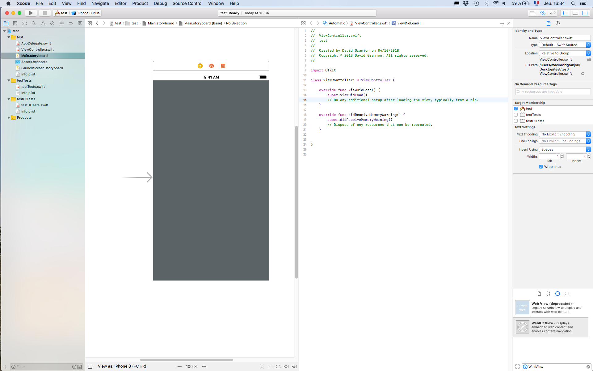

+++
  title = "Create a simple webviewer for shiny (IOs/Xcode)"
  date = "2018-10-04"
+++
    
## Important Note

This blog post is a summary of this brief but excellent [tutorial](https://www.youtube.com/watch?v=6tr6tpKC8Tg).
What you need is macOS with Xcode.

## Getting started with Xcode
* Open Xcode
* Create a new Xcode Project
* Select "Single View App"" (by default on my machine) then Next
* Add a name to the project then click on Next. The default language is Swift, do not
change anything!
* Choose a folder where to store your project and click on create
* On the left panel, select the Main.storyboard file
* Choose "WebKit View" on the bottom right panel and drag it in the central panel (where the IOs screen appears)
* Resize it to cover the whole screen
* Click on the code editor (second button of the top right toolbox)

## The code

After following all steps, you should end up with this code:


//
//  ViewController.swift
//  test
//
//  Created by David Granjon on 04/10/2018.
//  Copyright © 2018 David Granjon. All rights reserved.
//

import UIKit

class ViewController: UIViewController {

    override func viewDidLoad() {
        super.viewDidLoad()
        // Do any additional setup after loading the view, typically from a nib.
    }

    override func didReceiveMemoryWarning() {
        super.didReceiveMemoryWarning()
        // Dispose of any resources that can be recreated.
    }

}


Replace it by what follows:


//
//  ViewController.swift
//  shinyLove
//
//  Created by David Granjon on 04/10/2018.
//  Copyright © 2018 David Granjon. All rights reserved.
//

import UIKit
import WebKit

class ViewController: UIViewController {

    @IBOutlet weak var webview: WKWebView!
    override func viewDidLoad() {
        super.viewDidLoad()
        // Do any additional setup after loading the view, typically from a nib.
        let url = URL(string: "https://dgranjon.shinyapps.io/bs4DashDemo/")
        let urlRequest = URLRequest(url: url!)
        
        webview.load(urlRequest)
    }

    override func didReceiveMemoryWarning() {
        super.didReceiveMemoryWarning()
        // Dispose of any resources that can be recreated.
    }

}


where the url could be replace by anything, for instance google.com.

## App Preview
A large range of devices is available: Ipad Air, Ipad Pro 12.9, Iphone 8, ...
so that you can test you app on multiple screen size.

<video width="800" height="600" controls>
  <source src="videos/shiny_webview.mp4" type="video/mp4">
</video>